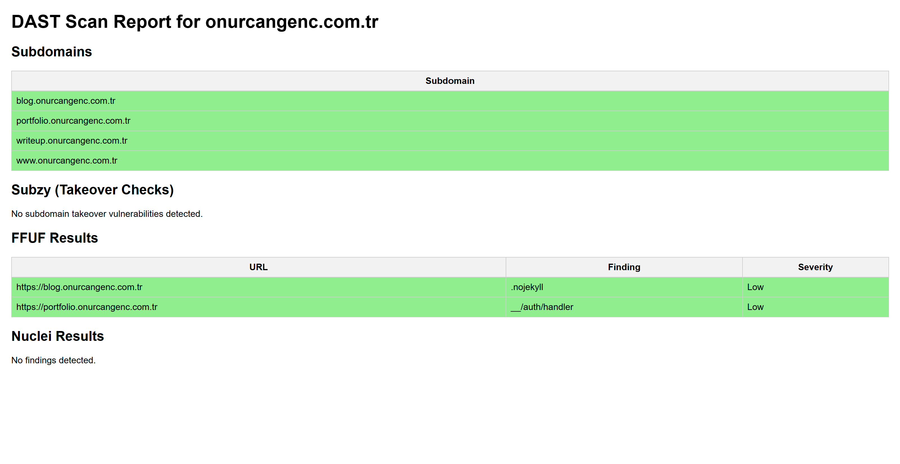

# 🔍 NucAIScan

**NucAIScan** is an **AI-assisted Dynamic Application Security Testing (DAST) pipeline** that automates reconnaissance, fuzzing, and vulnerability scanning.

It chains **Subfinder, httpx, Subzy, FFUF (heuristic fuzzing), and Nuclei** with optional **AI-powered template selection** and automated HTML reporting.

## ✨ Features
- **Subdomain discovery** with Subfinder  
- **Alive check** with httpx (HTTPS-first)  
- **Subdomain takeover detection** with Subzy  
- **Endpoint fuzzing** with FFUF + smart baseline heuristics  
- **Tech stack detection** from headers, paths, cookies, body  
- **Template selection**:
  - `--backend` override (e.g. php, next, wordpress)  
  - `--ai` mode for OpenAI-based smart template reduction  
- **Vulnerability scanning** with Nuclei  
  - Always includes fallback `exposures/` templates  
- **Reporting**:
  - Auto-generated **HTML report** (with severity coloring)  
  - Plain-text fallback for small scans  


## 🏗️ Architecture

### Use Case Diagram


### Class Diagram


### Activity Diagram


## 📦 Installation
```bash
git clone https://github.com/onurcangnc/NucAIScan.git
cd NucAIScan
pip install -r requirements.txt
```

You will also need:

- [Subfinder](https://github.com/projectdiscovery/subfinder)  
- [httpx](https://github.com/projectdiscovery/httpx)  
- [Subzy](https://github.com/LukaSikic/subzy)  
- [FFUF](https://github.com/ffuf/ffuf)  
- [Nuclei](https://github.com/projectdiscovery/nuclei)

## Example Run

### Default full scan
```bash
python -m ffufai targetdomain.com
```

-> Runs full pipeline: Subfinder → httpx → Subzy → FFUF → tech signals Nuclei (with exposures/). If there were no signals created based on heuristic string matching on curl outputs, then it will apply exposures as fallback.

### With backend override
```bash
python -m ffufai target.com --backend php
```
-> Only Nuclei templates related to PHP backend are selected.

### With backend override + AI mode
```bash
python -m ffufai target.com --backend php --ai
```
-> Forces backend as PHP and applies AI-powered recommendation on all Nuclei templates to reduce the template set for a more precise Nuclei scan.

```bash
python -m ffufai target.com --backend wordpress --ai
```

-> Backend is selection forced to WordPress and AI decides on the remaining WordPress template candidates and result will be more precise template set according to the application & endpoints and AI.

### With AI mode
```bash
python -m ffufai target.com --ai
```
-> Tech signals are passed to OpenAI API, which narrows down the most relevant templates from your template pool.

## Example Report
Sample HTML output (with severity coloring):



## SW Design Principles
- **SOLID** modular design:
  - `scanners/` → subdomain, takeover, ffuf, nuclei integrations  
  - `ai/` → template selection logic  
  - `core/` → utils, logging  
  - `report/` → HTML reporting  
- **Clean architecture**: Each module has a single responsibility  
- **Extendable**: Easily add new scanners or wordlists  

## 📌 Roadmap
- [ ] Elasticsearch integration  
- [ ] AI-powered false positive Nuclei scan filtering & severity scoring
- [ ] Docker container for one-line deployment  

## 📜 License
MIT License © Onurcan Genç